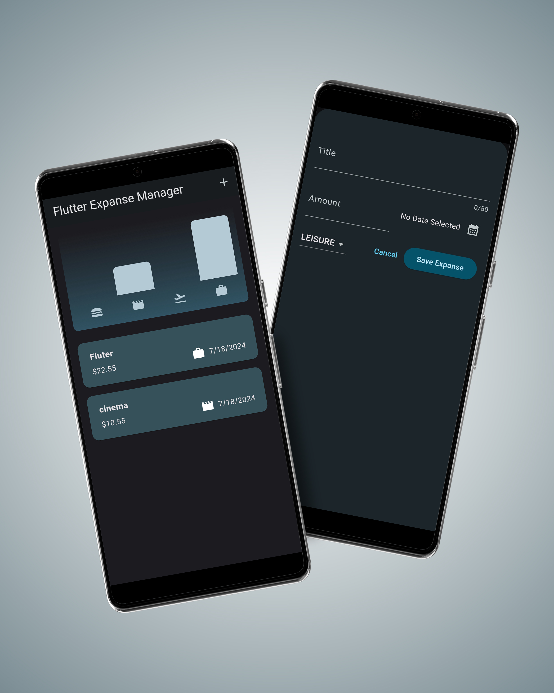
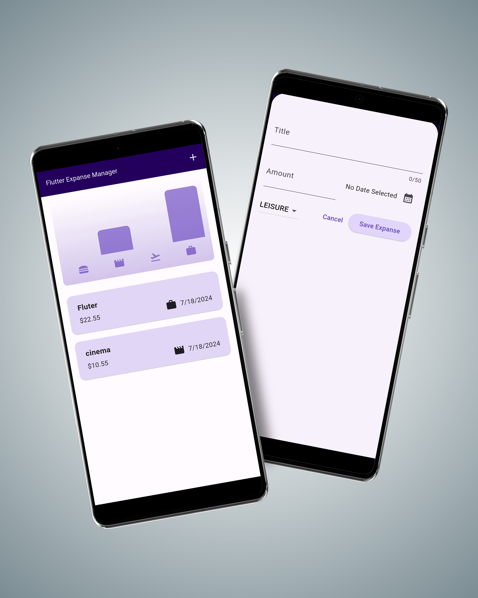

# Expense Tracker App

A Flutter-based expense tracker application that allows users to add, view, and manage their expenses with a detailed category-wise expense chart. The app supports system theme preference, displaying a dark theme when the system is set to dark mode.

## My Screens:
  

  
  

## Features

- **Add Expenses**: Users can add new expenses by specifying the title, amount, date, and category.
- **View Expenses**: The main page displays a chart of all categories showing the total expenses for each category and a list of all expenses.
- **System Theme Support**: The app adapts to the system theme, supporting both dark and light modes.